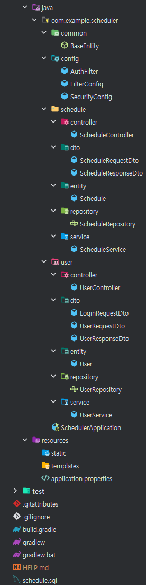
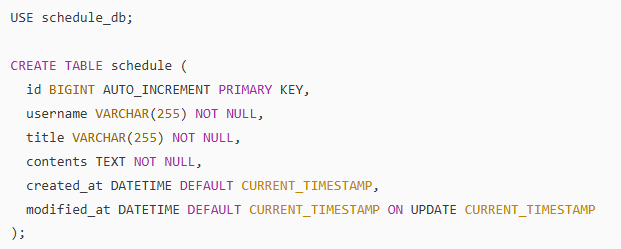
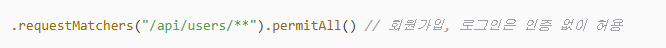
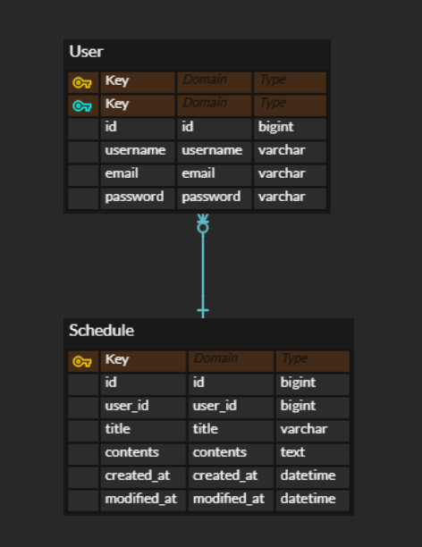

# 📆 일정 관리 앱 Develop Project

---
>**Spring Boot 기반의 일정 관리 API 프로젝트**

**개발기간** : 2025.05.15 ~ 2025.05.26

**기술 스택** : Spring Boot, JPA, MySQL, IntelliJ, Postman

**개발 환경** : Java

---

## 📕 Lv. 1 ~ Lv. 3

**구현한 내용 요약**
>1. Spring Boot + JPA + MySQL을 활용해 회원가입 및 일정 CRUD 기능을 구현하였다.
>2. 패키지는 User와 Schedule로 나누어 보기 쉽게 나누어 관리하였다.
>3. 각 기능별로 Controller, Service, Repository를 구성하여 3계층 구조를 갖추었다.
>4. 직접 Postman을 사용해 사용자가 회원가입 및 일정등록을 할 수 있는지 API를 직접 테스트하였다.

---
**Lv.1 일정 CRUD 기능 구현**

>- Controller : 일정 생성, 조회, 수정, 삭제 API 구현
>- Service : 비즈니스 로직 처리
>- Repository : JPA를 통한 데이터베이스 연동

---
**Lv.2 유저 CRUD 기능 구현**

>- Controller : 사용자 생성, 조회, 수정, 삭제 API 구현
>- Service : 비즈니스 로직 처리
>- Repository : JPA를 통한 데이터베이스 연동

**추가로 사용한 어노테이션**

>- @Column(각 필드에 대한 컬럼 설정)

---
**Lv.3 회원가입 기능 구현**

>- Controller : 회원가입 요청 처리
>- Service : 사용자 정보 저장 및 비즈니스 로직 처리
>- Repository : 사용자 정보 저장 및 조회

---

## 📗 Lv. 4

**구현한 내용 요약**
>1. 로그인 요청 처리
>2. 이메일 / 비밀번호 검증 로직 구현
>3. 로그인 성공 시 세션에 사용자 정보 저장
>4. 로그인 실패 시 예외 메세지 출력

## 📖디펙토리 구조

---

## 💢트러블슈팅💢

**1. MySQL Workbench에서 SQL 실행 시 오류 발생**

| | |
|---|---|
| **문제** | USE schedule_be; 구문 없이 테이블 생성 SQL을 실행하여 DB를 선택하지 못함 |
| **해결방안** | > |

**2. 403 오류 발생**

| | |
|---|--|
| **문제** | 인증이 필요한 API에 접근 시 403 오류 발생 |
| **해결방안** | SecurityConfig.java 생성, 인증이 필요 없는 경로 설정  |

**3. Lombok @Getter 사용 중 getId() 인식 오류 트러블슈팅**

| | |
|---|---|
| **문제** | Lombok의 @Getter 는 해당 클래스의 필드에만 적용되어 오류 발생 , User 클래스에서 import가 누락됨. |
| **해결방안** | User 클래스에 @Getter 어노테이션 추가|

**4. SecurityConfig 위치 관련 트러블슈팅**

| | |
|---|---|
| **문제** | Sprinng Security 설정 파일인 SecurityConfig.java를 scheduler.user.config 패키지 안에 작성하였음. |
| **해결방안** | scheduler.config 패키지로 이동함.|

---

## 📘 Scheduler 프로젝트 API 명세서

**Base URL**
> http://localhost:8080

---

## 🧑‍ 사용자(User) API

| 기능       | Method | URL                 | 요청 데이터 (request)                                                   | 응답 데이터 (response)                 | 상태 코드               |
|------------|--------|---------------------|--------------------------------------------------------------------------|----------------------------------------|--------------------------|
| 회원가입   | POST   | `/api/users/signup` | `{ "username": "", "password": "", "email": "" }`                        | 회원가입 성공 메시지                   | 200 OK / 400 BAD_REQUEST |
| 로그인     | POST   | `/api/users/login`  | `{ "email": "", "password": "" }`                                       | 로그인 성공 메시지                     | 200 OK / 401 UNAUTHORIZED |

---

## 🗓️ 일정 관리 앱 API

| 기능         | Method | URL                      | 요청 데이터 (request)                          | 응답 데이터 (response)   | 상태 코드               |
|--------------|--------|--------------------------|-------------------------------------------------|---------------------------|--------------------------|
| 일정 등록    | POST   | `/api/schedules`         | `{ "username": "", "title": "", "contents": "" }` | 생성된 일정 정보         | 200 OK / 400 BAD_REQUEST |
| 전체 조회    | GET    | `/api/schedules`         | -                                               | 일정 리스트               | 200 OK                   |
| 단건 조회    | GET    | `/api/schedules/{id}`    | -                                               | 해당 일정 데이터          | 200 OK / 404 NOT_FOUND   |
| 일정 수정    | PUT    | `/api/schedules/{id}`    | `{ "title": "", "contents": "" }`              | 수정된 일정 정보         | 200 OK / 404 NOT_FOUND   |
| 일정 삭제    | DELETE | `/api/schedules/{id}`    | -                                               | 삭제 완료 메시지         | 200 OK / 404 NOT_FOUND   |

---

## ⚠️ 예외 및 에러 처리

| 상황                          | 응답 코드           | 메시지 예시                           |
|-------------------------------|----------------------|----------------------------------------|
| 중복된 사용자명/이메일        | 400 BAD_REQUEST      | "이미 존재하는 사용자 이름입니다."     |
| 이메일 미존재 로그인 시도     | 401 UNAUTHORIZED     | "등록되지 않은 이메일입니다."         |
| 비밀번호 불일치               | 401 UNAUTHORIZED     | "비밀번호가 일치하지 않습니다."       |
| 존재하지 않는 일정 요청       | 404 NOT_FOUND        | "일정을 찾을 수 없습니다."            |

---

## 👀 ERD (Entity Relationship Diagram)

